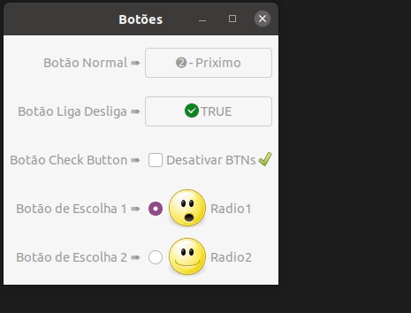
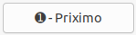
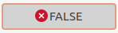
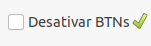
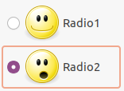

# cap5_buttons_gtkmm3.0
### OBS: Atenção, este arquivo são anotações de estudo, alguns procedimentos podem não ser corretos.
Apresenta um app com demostrações de alguns tipos de botões da API GTKMM3.0

## Perguntas respondidas:

* Como criar um widget do tipo Gtk::Button?
* Como criar um widget do tipo Gtk::ToggleButton?
* Como criar um widget do tipo Gtk::RadioButton?
* Como criar um widget do tipo Gtk::CheckButton?
* Como inserir icones nos botões?
* Como deixar um botão inativo com a flag Gtk::STATE_INSENSITIVE?
* Como criar grupo para o Gtk::RadioButton?
* Como inserir tooltips do tipo text, markup e window?

* ## App

    

* ### Tipos de Botões 

    * `Gtk::Button`, este tipo de botão foi apresentado no exemplo anterior.

        

    * `Gtk::ToggleButton`, possui todas as características do tipo `GtK::Button`, porém, ao ser pressionado ele fica no estado pressionado. 

             

        Para deixar o botão desativado e atvado foi utilizado o método:
        
        `this->m_btn.set_state(Gtk::STATE_INSENSITIVE)`.
        
        `this->m_btn.set_state(Gtk::STATE_NORMAL)`.

    * `Gtk::CheckButton`, observe que assim como os `Gtk::Button`, pode ser adicionado imagem, imagem e label ou somente label.

        

    * `Gtk::RadioButton`, semelhante ao checkbutton, porém, deve ser utilizado em grupo. O uso único não faz sentido. 

        

        Para este botão é necessário criar um grupo. Este grupo deve ser adicionado aos botões utilizando o o método `set_group(Gtk::RadioButton::Group &group)`, Observe.

        ~~~c++
        /Cria grupo para o Radio Buton
        Gtk::RadioButton::Group r_group; 
        this->m_rad_btn1.set_group(r_group); 
        this->m_rad_btn2.set_group(r_group);
        ~~~

    * ### Todos os tipo de botões acima podem ser adicionados tooltips. O procedimento para inserção foi apresentado no [cap3_basico](https://github.com/upuaut-wq/cap3_basico).

        * **Tooltips do tipo texto** -> `void set_tooltip_text(const Glib::ustring &text)`. Exemplo.
        
            ~~~c++ 
            this->m_btn.set_tooltip_text("Texto");
            ~~~
         
        
        * **Tooltips do tipo markup** -> `this->btn.set_tooltip_markup(const Glib::ustring &text);`

            ~~~c++
            this->m_btn.set_tooltip_markup("ToolTip com Tags!!!");
            ~~~

            Mais informações sobre formatação para o `set_tooltip_markup`, acesse o [aqui...](https://docs.gtk.org/Pango/pango_markup.html).

         

        * **Tooltips do tipo Window** -> `this->btn.set_tooltip_window(Gtk::Window &custom_window);`. O exemplo abaixo foi utilizado um `Gtk::Label`.

            ~~~c++
            this->m_tog_btn.set_tooltip_window(this->m_window);
            this->m_label_tp.set_label("Texto");
            this->m_tooltip.add(this->m_label_tp);    //Adiciona o label ao tooltip.
            this->m_tooltip.set_default_size(300,50); //Tamanho do tooltip.
            this->m_label_tp.show(); //Mostra o label, sem esta opção o tooltip vai aparecer sem conteudo 
            ~~~

            Para ativar o tooltip do tipo window é necessário ter um sinal.

            No arquivo .h

            ~~~c++
            bool on_btn_tooltip(int x, int y,bool keyboard_tooltip,const Glib::RefPtr<Gtk::Tooltip> &tooltip);
            ~~~

            No arquivo .cpp

            Sinal Implementado.

            ~~~c++
            bool Botoes::on_btn_tooltip(int, int, bool, const Glib::RefPtr<Gtk::Tooltip>&){
            return true;
            }   
            ~~~

            Ligação entre o sinal e o botão.

            ~~~c++
            this->m_tog_btn.signal_query_tooltip().connect(sigc::mem_fun(*this,&Botoes::on_btn_tooltip));
            ~~~
    
             obs: Vale mencionar, que, para esta última opção depois que inseri o tootip window, não consegui retirar para adicionar um do tipo text.

     
